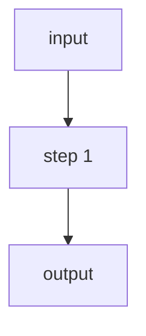

# Sensible SenseML Docs — Concept Topic Template

This file is a guide for writing new concept pages under `docs/Senseml reference/concepts/`. Concept pages explain how something works — they are not reference pages (no Parameters section, no example download tables). Use the annotated template below and the structural variants section to choose the right shape for your topic.

---

## Frontmatter

Same structure as all SenseML reference pages. Only `title` and `metadata.description` vary.

```yaml
---
title: Concept name
excerpt: ''
deprecated: false
hidden: false
metadata:
  title: ''
  description: 'Short phrase describing the concept'
  robots: index
next:
  description: ''
---
```

`metadata.description` is 4–7 words, lowercase except proper nouns. Examples:
- `'Understanding extraction coverage'`
- `'Control field extraction order'`
- `'Optical character recognition overview'`
- `'Understanding text lines in PDFs'`

---

## Opening paragraph

1–4 sentences that define the concept and state why it matters. Use imperative or declarative tone — start with a verb or a noun phrase, not "The X is...".

**Good examples from existing pages:**
- "Extraction coverage measures how fully an extraction captures your target data from the document."
- "Use fallback fields to handle document variations in a document type. If a field fails to extract data, you can specify a backup, or fallback field to extract the same data using a different method."
- "A *line* is a rectangular region containing text. Sensible represents a line's boundary box as a gray box."

**Optionally, add an advanced-topic callout right before the opening paragraph** when the concept is for experienced users only:

```markdown
**Note:** If you're familiar with Sensible, this advanced topic is for you.
```

---

## H2 section structure

Concept pages use H2 headings to divide the body. There is no prescribed list of sections — choose headings that match the topic shape.

**Common H2 patterns:**

| Topic shape | Typical H2 sections |
|---|---|
| How a feature works (process/steps) | How X works, Configuration options, Troubleshooting |
| Reference overview (links out to related features) | Feature area 1, Feature area 2 |
| Concept with variants | Default behavior, Configurable behavior, Notes |
| Concept with formula or calculation | Formula, Example, Notes |
| Comparison of options | (table in intro), then one H2 per option |

---

## Optional elements

### Limitations block

Use bold "**Limitations:**" (not an H2) followed by a bullet list when there are hard constraints on the feature. Place this in the opening section, not as a footer.

```markdown
**Limitations:**

* Fallbacks don't work across nested objects.
* Fallbacks don't work within a Query Group method.
```

### Notes section

Use `## Notes` (H2) for miscellaneous callouts that don't fit in the body. For very short notes lists, use bold `**Notes**` (not H2) followed by bullets.

```markdown
## Notes

* Sensible excludes suppressed fields when calculating coverage.
* The overall coverage for a portfolio document is the weighted average of all subdocument coverages.
```

### Option comparison table

When the concept has multiple configuration approaches, a comparison table in the intro is effective before diving into per-option H2 sections.

```markdown
| option | configurable for | notes |
| ------ | ---------------- | ----- |
| [OCR Level parameter](doc:ocr-level) | document types | Use to configure whole-document OCR criteria. |
| [OCR preprocessor](doc:ocr-preprocessor) | configs | Use to OCR specified pages or page ranges. |
```

### Code examples

Use fenced ` ```json ` blocks. Inline `//` comments are acceptable — Sensible accepts relaxed JSON.

Concept pages typically embed code inline rather than using the "Config / Example document / Output" scaffold from reference pages. Truncate illustrative output to 2–3 representative lines + `"..."` if needed.

### Images

```markdown

```

Always use `![Click to enlarge]`. Images live in `assets/images/final/`.

### Mermaid diagrams

Mermaid diagrams are acceptable for workflow/decision flow concepts:

```

```

---

## Filled template — copy and adapt

The following is a starting scaffold. Delete or add H2 sections as needed for the topic.

```markdown
---
title: Concept name
excerpt: ''
deprecated: false
hidden: false
metadata:
  title: ''
  description: 'Short phrase describing the concept'
  robots: index
next:
  description: ''
---
[Opening paragraph: 1–4 sentences defining the concept and why it matters.]

## [Main concept section]

[Explanation, steps, or examples. Add more H2s as needed.]

## [Second concept section]

[Continue as needed.]

## Notes

* [Optional: cross-references or edge-case callouts that don't fit above.]
```

---

## File naming and registration

- Filename: `kebab-case.md`, e.g., `anchor-nuances.md`, `field-order.md`
- Location: `docs/Senseml reference/concepts/`
- After writing the file, add the slug (filename without `.md`) to `docs/Senseml reference/concepts/_order.yaml`
- No link needed in `index.md` — it just says "see child topics"
