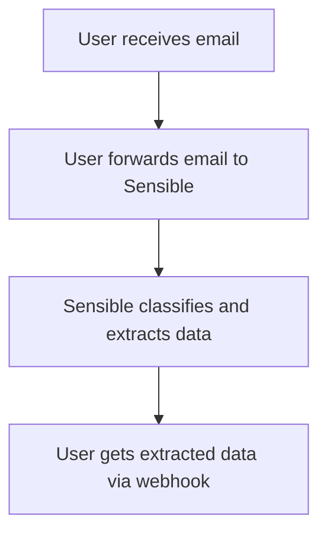
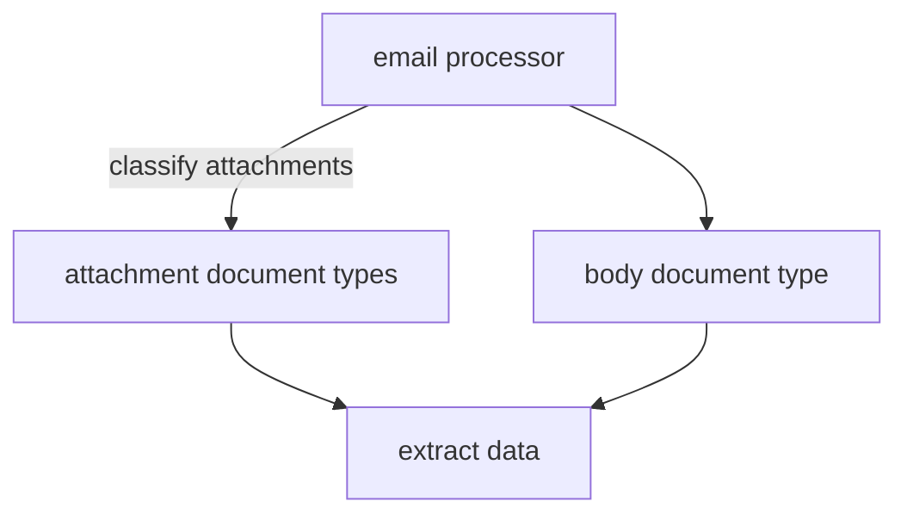

## Introduction

You can automatically extract structured data from email bodies and attachments by forwarding them to Sensible.

The following image shows an overview of  email extraction:

<br />




## Implementation overview

To implement this workflow, take the following general steps:

* **Determine email filters**

  1. Determine a set of similar emails from which you want to extract data. For example, you're in PropTech and you want to extract data from residential lease applications.

  2. Determine email filtering criteria for the set of emails. In a succeeding step,  use the filters to automatically forward these emails to a Sensible email address.

* **Configure data extraction**
  1. In the Sensible app, define a [document type](doc:document-type-settings) for each email attachment in the lease application emails from which you want to extract data. You can optionally define a document type for the email body. For example, `driverse_licenses`, `paystubs`, `leases`, and `email_body_lease_applications`.

* **(Optional) Configure data destination**
  1. By default, view the extracted data in the Sensible app. Optionally you can also define webhooks to receive the extracted data.

* **Create email processor**
  1. When you've completed the preceding steps, contact Sensible to create an _email processor_. An email processor contains the specified document types, webhook URLs, and forwarding email aliases. You can now start forwarding emails to the processor and receive extracted data.

* **(Optional) Send a test email**
  1. Download sample documents and send a test email to view an example extraction.

* **(Optional) Test in dev**
  1. Make changes to your extraction configs and test in a dev environment  before going into production.

## Getting started

Let's walk through an example of implementing an email processor. In this example implementation, you're in PropTech and you want to extract data from lease applications addressed to the property manager "Sensible Property."  Lease application emails to this property manager typically include the following attachments:

* drivers license
* signed lease
* combined PDF file ("portfolio")
  * tax statement
  * bank statement
  * paystub

TODO called `brenda_sample_gusto_1040_wellsfargo`containing:

The following image shows an example email:


You'll create a `residential_lease_applications` email processor to handle emails like this one.

## Determine email filters

1. Determine your filtering criteria for forwarding Sensible Property lease applications. For example, you filter by emails addressed to `applications@sensibleproperty.com`.

## Configure data classification and extraction

To configure email data classification and extraction in your Sensible account, take the following steps.

#### Create out-of-the-box document types

Create document types to [classify](doc:classify) and extract from the paystub, drivers license, and signed lease attachments:

1. Follow the steps in [Out-of-the-box extractions](doc:library-quickstart) to add extraction support for the following document types to your account:
   1. **driver_license** document type
   2. **pay_stubs** document type

#### (Optional) Create custom document types

Sensible doesn't provide out-of-the-box extraction support for leases. To create support in your account, take the following steps:

1. Create a document type for **leases**. In the **Document Types** tab, Click **New document type**. In the dialog, take the following steps:

   1. Name the document type `leases`.
   2. Upload the following example document:

   | Example document | [Download link](https://raw.githubusercontent.com/sensible-hq/sensible-docs/v0/assets/pdfs/email_lease.pdf) |
   | ---------------- | ----------------------------------------------------------------------------------------------------------- |

   3. Name the config `sensibleproperties`  for the fictional property management company in this example.
   4. After you create the document type, edit the config you created. Paste the following code into the left pane:

      ```json
      {
        "fields": [
          {
            "method": {
              "id": "queryGroup",
              "searchBySummarization": "page",
              "queries": [
                {
                  "id": "tenancy_terms_start",
                  "description": "tenancy terms start date",
                  "type": "date"
                },
                {
                  "id": "tenancy_terms_end",
                  "description": "tenancy terms end date",
                  "type": "date"
                },
                {
                  "id": "monthly_rents_dollars",
                  "description": "monthly rents in dollars",
                  "type": "currency"
                }
              ]
            }
          }
        ]
      }
      ```

2. (Optional) Create a document type for **lease application email bodies**:

   1. Follow the preceding steps to create a document type named `email_body_lease_applications` with a config named `sensibleproperties`. Upload the following example document:

   | Example document | [Download link](https://raw.githubusercontent.com/sensible-hq/sensible-docs/v0/assets/pdfs/email_body_lease.pdf) |
   | ---------------- | ---------------------------------------------------------------------------------------------------------------- |

   **Note**: This example document is a PDF exported from an email body for testing. In production, Sensible automatically converts email bodies to PDFs.

   2. In the config, paste the following code:

```json
{
  "fields": [
    {
      "method": {
        "id": "queryGroup",
        "searchBySummarization": "page",
        "queries": [
          {
            "id": "applicant_name",
            "description": "What is the name of the applicant?",
            "type": "string"
          },
          {
            "id": "date_sent",
            "description": "What is the date the email was sent?",
            // this type formats the extracted data as a ISO 8601 date
            "type": "date"
          },
          {
            "id": "attachment_count",
            "description": "How many attachments are included in the email?",
            "type": "string"
          }
        ]
      }
    }
  ]
}
```

Click TODO HOW TO PUBLISH TO PRODUCTION

### How it works: email processors and document types

Your `residential_lease_applications` email processor uses the document types you configured in previous steps for classification and extraction:

1. You specify multiple document types in the email processor for possible attachments. The email processor [classifies](doc:classify) each attachment against the document types you specify:
   1. If you specify that the attachments are [portfolios](doc:portfolio) files (TODO DEFINE), Sensible searches each file for all the document types you specify and can classify each file into multiple document types. If you expect a mix of portfolio and single-file document files, then specify portfolio TODO FOR WHAT. Sensible can still segment a single-document file without affecting extraction accuracy, though there may be some additional processing overhead. For example, Sensible classifies the `brenda_sample_gusto_1040_wellsfargo` attachement against TODO list all the doc types and finds that it contains the XYZ doc types.
   2. If you specify that the attachments are single-file, Sensible classifies each file against each document type, and assigns a signle document type to each file.   For example, it classifies an attached lease agreement against `driver_license`, `pay_stubs`, and `leases` document types and determines that it's a `pay_stub`.  TODO add the full list of doc types here. The email processor then uses the `pay_stubs` document type to extract data from the attachment.

2. You specify one document type for the email body, for example, `lease_application_email_bodies`. The email processor extracts data using that document type.

TODO: update diagram for portfolio vs single file

<br />




Each document type contains [_configs_](doc:config-settings), or collections of [SenseML](doc:senseml-reference-introduction) queries for extracting document data. Configs handle variations in a document type. For example, each config in the `pay_stubs` document type handles a different paystub software vendor, such as Gusto, ADP, or Paylocity. You can publish configs to a development environment for testing before publishing them to production.

## (Optional) Configure data destination

To receive extracted email data, you have the following options:

* By default, view and download the extracted data in the Sensible app on the **Extraction history** tab:


* Implement webhooks as destinations for the extracted data. You can specify a webhook for each environment to which you publish your configs.  See the following sections for more information.

## Create email processor

In the preceding steps, you configured the necessary prerequisites for an _email processor_ that can handle lease applications. Contact Sensible to create the email processor. Provide the following details:

* the name of the email processor, for example, `residential_lease_applications`.
* the names of the document types you created in your account (`driver_license`, `pay_stubs`, `leases`, and `email_body_lease_applications`).
* whether you expect the processor to handle single-document files attachments, portfolio attachments, or both. TODO REWORD
* (optional) the URL of each webhook you implemented.

After creating the email processor, Sensible provides you with the email address for the processor, for example: `residential_lease_applications.abc_xyz@app.sensible.so`

Forward your lease application emails to this address.

## (Optional) send a test email

Send a test email with attachments to the processor you created. You can download example documents from the following locations:

TODO TEST LINKS

| document                                                             | link                                                                                                                         |
| -------------------------------------------------------------------- | ---------------------------------------------------------------------------------------------------------------------------- |
| Drivers license                                                      | [Download link](https://raw.githubusercontent.com/sensible-hq/sensible-docs/v0/assets/pdfs/email_drivers_license_sample.pdf) |
| Portfolio file containing bank statement, paystub, and tax statement | [Download link](https://raw.githubusercontent.com/sensible-hq/sensible-docs/v0/assets/pdfs/portfolio_bank_paystub_tax.pdf)   |
| Lease                                                                | [Download link](https://raw.githubusercontent.com/sensible-hq/sensible-docs/v0/assets/pdfs/email_lease.pdf)                  |

For the body, use the following text:

> Dear Anita Patel,
>
> I hope you’re doing well. I’m writing to formally submit my application for the rental unit at 123 Sample St unit #3. I am very interested in leasing this apartment and have attached all the necessary documents for your review.
>
> Please find attached:
>
> * Signed lease agreement
> * Proof of income (recent pay stub)
> * Copy of my ID (driver’s license)
>
> Please let me know if you need any additional information or if there are any next steps in the approval process.
>
> Thank you for your time and consideration. I look forward to your response.
>
> Best regards,  
> Brenda Sample  
> (505) 123 4567  
> [brenda.sample@gmail.com](mailto:brenda.sample@gmail.com)

You should get back an extraction response for each attachment at the webhook you specified.

In the Sensible app, click each extraction to view its data. For example, the paystub extraction includes the extracted fields `employer_name: Delta Airlines` and `employee_name: Brenda Sample`:


## (Optional) test in dev

If you make a change to a config, you can test it in dev before going live in production.

For example, say you make the following change in your config for extracting from lease application attachments:

TODO test this code is valid

```json
{
  "fields": [
    {
      "method": {
        "id": "queryGroup",
        "searchBySummarization": "page",
        "queries": [
           /* old prompt was 'What is the name of the applicant?' new simplified prompt asks for last and first names separately */
          {
            "id": "applicant_first_name",

            "description": "Applicant first name",
            "type": "string"
          },
            {
            "id": "applicant_last_name",

            "description": "Applicant last name",
            "type": "string"
          }
        ]
      }
    }
  ]
}
```

To test the change in a development environment:

1. Publish the config to the development environment
2. Specify the development environment in the forward address by prepending it, for example, `dev.residential_lease_applications.abc_xyz@app.sensible.so`.   If you omit the environment prefix, Sensible defaults to the* _`production`_ *environment.

View the results in the Sensible app, or in the webhook you specified for development environment in a previous step.
