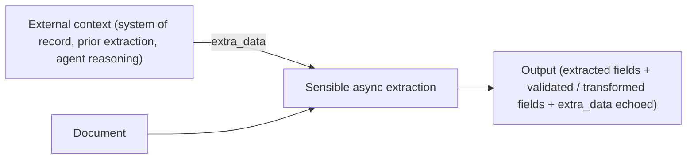

Use this method to bring data you supplied in an `extra_data` object in an extraction request into a config's context, so you can use the extra data for validations, data transformation, and postprocessing of the extracted document data. You can customize each `extra_data` object for each document for which you request extraction.&#x20;

Common use cases include:

- **Chain extractions for cross-document validation**: Extract fields from a first document (for example, name and date of birth from a loan application), then pass them as `extra_data` into an extraction request for a second document (for example, the loan applicant's bank statement). The config for the second document compares the extracted values from the first and second documents and outputs Boolean values to indicate if the applicant's name and date of birth are consistent in both documents.
- **Incorporate external data**: After extracting a VIN from an auto insurance document, call a third-party lookup service and pass the result (for example, recorded mileage) back as `extra_data` in a follow-up request to the same document. The config compares the lookup value to the extracted value and flags any discrepancy.



For information about supplying`extra_data` in an extraction request, see the asynchronous extraction endpoints, for example, the [Generate upload URL](ref:generate-an-upload-url) endpoint.

# Parameters

The following parameters are in the computed field's [global Method](doc:computed-field-methods#parameters) parameter:

| key                | value       | description                                                                                                                                                                                                                                                                                                                                                                                                                                                                                                                                                                                                                                                                                                                                                                          |
| :----------------- | :---------- | :----------------------------------------------------------------------------------------------------------------------------------------------------------------------------------------------------------------------------------------------------------------------------------------------------------------------------------------------------------------------------------------------------------------------------------------------------------------------------------------------------------------------------------------------------------------------------------------------------------------------------------------------------------------------------------------------------------------------------------------------------------------------------------- |
| id (**required**)  | `extraData` |                                                                                                                                                                                                                                                                                                                                                                                                                                                                                                                                                                                                                                                                                                                                                                                      |
| key (**required**) | string      | Key to look up in the request's `extra_data` object.<br /> If the request omits `extra_data`, if the object doesn't contain the specified key, or if the specified key's value is null, Sensible returns null. These cases aren't distinguishable in the output.<br />The `extra_data` object must be flat: strings, numbers, booleans, or null. Nested objects and arrays aren't supported.<br />When you submit a [portfolio](doc:portfolio) extraction with `extra_data`, Sensible passes the same object to every document extracted from the portfolio. For example, if a portfolio contains an auto insurance declarations page and a loan application, both configs can independently look up the same `extra_data` keys and produce their own computed fields based on them. |

# Examples

The following example uses the Extra Data method to cross-check values from a policy management system against a GEICO auto insurance declarations page.&#x20;

**Config**

```json
{
  "fields": [
    {
      "id": "collision_deductible",
      "type": "currency",
      "anchor": {
        "match": [
          { "text": "Coverages", "type": "startsWith" },
          { "text": "Collision", "type": "startsWith" }
        ]
      },
      "method": {
        "id": "row",
        "position": "right",
        "tiebreaker": "first" /* leftmost value in row = the Limits and/or Deductibles column */
      }
    },
    {
      "id": "comprehensive_deductible",
      "type": "currency",
      "anchor": {
        "match": [
          { "text": "Coverages", "type": "startsWith" },
          { "text": "Comprehensive", "type": "startsWith" }
        ]
      },
      "method": {
        "id": "row",
        "position": "right",
        "tiebreaker": "first" /* leftmost value in row = the Limits and/or Deductibles column */
      }
    },
    {
      "id": "expected_insured_vehicle",
      "method": { "id": "extraData", "key": "expected_insured_vehicle" } /* pulls expected vehicle make, model, and year (NISSAN ROGUE 2010) from the `extra_data` object you provided in the extraction request. precedes the `vehicle_matches` LLM query so that following source_ids can reference it  */
    },
    {
      "method": {
        "id": "queryGroup",
        "queries": [
            
            "id": "insured_vehicle",
            "description": "year, make, and model of the first vehicle listed on the policy", /* Use an LLM to extract vehicle information from the document */
            "type": "string"
          }
        ]
      }
    },
    {
      "method": {
        "id": "queryGroup",
        "source_ids": [
          "expected_insured_vehicle",
          "insured_vehicle"
        ] /* gives the LLM both values as context for a semantic comparison */,
        "queries": [
          {
            "id": "vehicle_matches",
            "description": "Do these two vehicle descriptions refer to the same vehicle? Ignore differences in capitalization and word order. Answer true or false.", /* expected output is true; vehicle names vary but are semantically the same*/
            "type": "boolean"
          }
        ]
      }
    },
    {
      "id": "expected_collision_deductible" /* pulls the expected value (500) from the `extra_data` object you provided in the extraction request. */,
      "method": { "id": "extraData", "key": "expected_collision_deductible" }
    },
    {
      "id": "expected_comprehensive_deductible" /* pulls the expected value (300) from the `extra_data` object you provided in the extraction request */,
      "method": {
        "id": "extraData",
        "key": "expected_comprehensive_deductible"
      }
    },
    {
      "id": "collision_deductible_matches" /* use deterministic logic to compare document's deductible to expected value. output is true*/,
      "method": {
        "id": "customComputation",
        "jsonLogic": {
          "==": [
            { "var": "collision_deductible.value" },
            { "var": "expected_collision_deductible.value" }
          ]
        }
      }
    },
    {
      "id": "comprehensive_deductible_matches" /* use deterministic logic to compare document's deductible to expected value. output is false */,
      "method": {
        "id": "customComputation",
        "jsonLogic": {
          "==": [
            { "var": "comprehensive_deductible.value" },
            { "var": "expected_comprehensive_deductible.value" }
          ]
        }
      }
    }
  ]
}

```

**Request**

To provide the extra data for the preceding config, take the following steps:

1. Create a document type in the Sensible app using the following example document.
2. Add a config to the document type using the preceding SenseML and publish the config to production.
3. Run the following command in a terminal, substituting your document type and your API key:

```bash
curl --location 'https://api.sensible.so/v0/extract_from_url/your_doc_type' \
--header 'Content-Type: application/json' \
--header 'Authorization: Bearer YOUR_API_KEY' \
--data '{
  "document_url": "https://raw.githubusercontent.com/sensible-hq/sensible-docs/v0/assets/pdfs/extra_data.pdf",
  "extra_data": {
    "expected_collision_deductible": 500,
    "expected_comprehensive_deductible": 300,
    "expected_insured_vehicle": "NISSAN ROGUE 2010"
  }
}'
```

**Example document**

The following image shows the example document used with this example config:


| Example document | [Download link](https://raw.githubusercontent.com/sensible-hq/sensible-docs/v0/assets/pdfs/extra_data.pdf) |
| ---------------- | ---------------------------------------------------------------------------------------------------------- |

**Output**

```json
{
        "collision_deductible": {
            "source": "$500",
            "value": 500,
            "unit": "$",
            "type": "currency"
        },
        "comprehensive_deductible": {
            "source": "$250",
            "value": 250,
            "unit": "$",
            "type": "currency"
        },
        "expected_insured_vehicle": {
            "value": "NISSAN ROGUE 2010",
            "type": "string"
        },
        "insured_vehicle": {
            "value": "2010 Nissan Rogue",
            "type": "string",
            "confidenceSignal": "confident_answer"
        },
        "vehicle_matches": {
            "value": true,
            "type": "boolean",
            "confidenceSignal": "not_supported"
        },
        "expected_collision_deductible": {
            "value": 500,
            "type": "number"
        },
        "expected_comprehensive_deductible": {
            "value": 300,
            "type": "number"
        },
        "collision_deductible_matches": {
            "value": true,
            "type": "boolean"
        },
        "comprehensive_deductible_matches": {
            "value": false,
            "type": "boolean"
        }
    }
```

In the preceding output, the `vehicle_matches` field is `true` even though `"NISSAN ROGUE 2010"` (policy system) doesn't equal `"2010 Nissan Rogue"` (document). The LLM recognizes they refer to the same vehicle. To compare numeric values, you use deterministic logic. The `collision_deductible_matches` field  is `true` because the deductible ($500) matches the expected value. The `comprehensive_deductible_matches` field is `false` because the document shows $250, not the expected $300.
