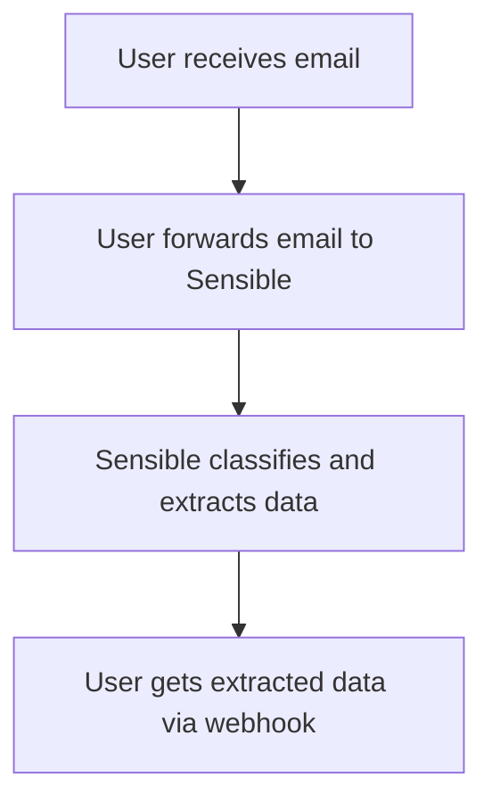
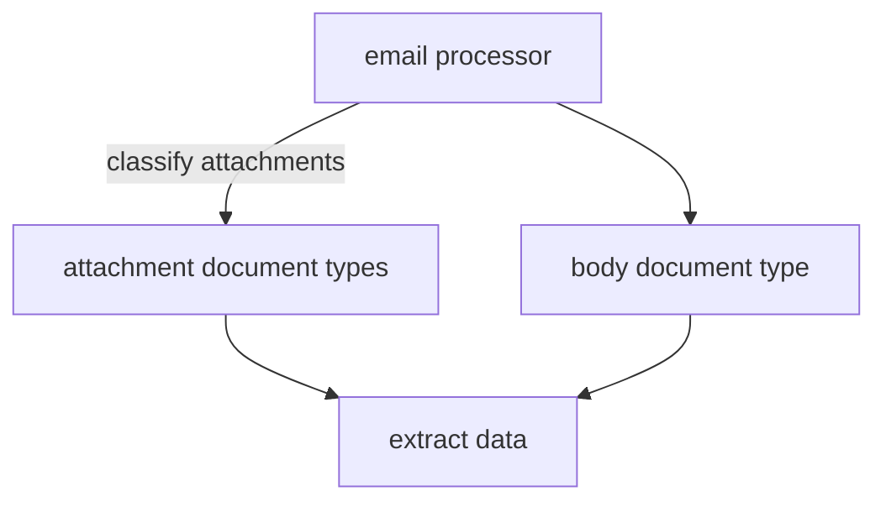

## Introduction

You can automatically extract structured data from email bodies and attachments by forwarding them to Sensible.

The following image shows an overview of  email extraction:




## Implementation overview

To implement this workflow, take the following general steps:

* **Determine email filters**
  - Determine a set of similar emails from which you want to extract data. For example, you're in PropTech and you want to extract data from residential lease applications.

  - Determine email filtering criteria for the set of emails. In a succeeding step,  use the filters to automatically forward these emails to a Sensible email address.

* **Configure data extraction**
  - In the Sensible app, define a [document type](doc:document-type-settings) for each email attachment in the lease application emails from which you want to extract data. You can optionally define a document type for the email body. In this example, the lease application emails include  `driverse_licenses`, `paystubs`, `leases`, `email_body_lease_applications`, and other document types.

* **(Optional) Configure data destination**
  
  - Define webhooks to receive the extracted data. You can also view the extracted data in the Sensible app, but you can trace the email source only through the webhook.
  
* **Create email processor**
  - When you've completed the preceding steps, create an _email processor_ in the Sensible app on the **Email processors** tab or with the API. An email processor contains document types, webhook URLs, and forwarding email aliases. You can then start forwarding emails to the processor and receive extracted data.

* **(Optional) Send a test email**
  - Download sample documents and send a test email to view an example extraction.

* **(Optional) Test in development**
  - Make changes to your extraction configs and test in a development environment before going into production.

See the following sections for a detailed example of implementing the preceding general steps.

## Getting started

The following example walks through implementing an email processor. In this example implementation, you're in PropTech and you want to extract data from lease applications addressed to the property manager "Sensible Property."  Lease application emails to this property manager typically include the following attachments:

* drivers license
* signed lease
* a single PDF file containing multiple documents (a "[portfolio](doc:portfolio)" file):
  * tax statement
  * bank statement
  * paystub

The following image shows an example email:


In the following steps, you'll create a `residential_lease_applications` email processor to handle emails like this one.

## Determine email filters

Determine your filtering criteria for forwarding Sensible Property lease applications. For example, you filter by emails addressed to `rental_applications@sensibleproperty.com`. In a later step, you'll create the Sensible address to which to forward these emails.

## Configure data classification and extraction

To configure email data classification and extraction in your Sensible account, take the following steps.

#### Create out-of-the-box document types

Create document types to [classify](doc:classify) and extract from the email attachments:

1. Follow the steps in [Out-of-the-box extractions](doc:library-quickstart) to add extraction support for the following document types to your account:
   1. **`driver_license`** document type
   2. **`pay_stubs`** document type
   3. **`bank_statements`** document type
   4. **`1040s`** document type

#### (Optional) Create custom document types

Sensible doesn't provide out-of-the-box extraction support for leases. To create support in your account, take the following steps:

1. Create a document type for **leases**. In the **Document Types** tab, Click **New document type**. In the dialog, take the following steps:

   1. Name the document type `leases`.
   2. Upload the following example document:

   | Example document | [Download link](https://raw.githubusercontent.com/sensible-hq/sensible-docs/v0/assets/pdfs/email_lease.pdf) |
   | ---------------- | ----------------------------------------------------------------------------------------------------------- |

   3. Name the config `sensibleproperties`  for the fictional property management company in this example.
   4. After you create the document type, edit the config you created. Paste the following code into the left pane:

      ```json
      {
        "fields": [
          {
            "method": {
              "id": "queryGroup",
              "searchBySummarization": "page",
              "queries": [
                {
                  "id": "tenancy_terms_start",
                  "description": "tenancy terms start date",
                  "type": "date"
                },
                {
                  "id": "tenancy_terms_end",
                  "description": "tenancy terms end date",
                  "type": "date"
                },
                {
                  "id": "monthly_rents_dollars",
                  "description": "monthly rents in dollars",
                  "type": "currency"
                }
              ]
            }
          }
        ]
      }
      ```

      

2. (Optional) Create a document type for **lease application email bodies**:

   1. Follow the preceding steps to create a document type named `email_body_lease_applications` with a config named `sensibleproperties`. Upload the following example document:

   | Example document | [Download link](https://raw.githubusercontent.com/sensible-hq/sensible-docs/v0/assets/pdfs/email_body_lease.pdf) |
   | ---------------- | ---------------------------------------------------------------------------------------------------------------- |

   **Note**: This example document is a PDF exported from an email body for testing. In production, Sensible automatically converts email bodies to PDFs.

   2. In the config, paste the following code:

```json
{
  "fields": [
    {
      "method": {
        "id": "queryGroup",
        "searchBySummarization": "page",
        "queries": [
          {
            "id": "applicant_name",
            "description": "What is the name of the applicant?",
            "type": "string"
          },
          {
            "id": "date_sent",
            "description": "What is the date the email was sent?",
            // this type formats the extracted data as a ISO 8601 date
            "type": "date"
          },
          {
            "id": "attachment_count",
            "description": "How many attachments are included in the email?",
            "type": "string"
          }
        ]
      }
    }
  ]
}
```

### How it works: email processors and document types

An email processor uses document types for classification and extraction:

1. The email processor [classifies](doc:classify) each attachment against the document types you specify for the email processor:
   1. If you specify to process all attachments as [portfolio](doc:portfolio) files, Sensible automatically segments each document by its page range in the file, and classifies each document in each file against all the document types you specify.

   2. If you specify to process all attachments as single-file documents, Sensible classifies each file as a single document type.

      If you expect a mix of portfolio and single-document files, then specify to process them all as portfolio files. Note this setting can add extra processing time for single-document files.
2. You specify one document type for the email body, for example, `lease_application_email_bodies`. The email processor extracts data using that document type.



Each document type contains [_configs_](doc:config-settings), or collections of [SenseML](doc:senseml-reference-introduction) queries for extracting document data. Configs handle variations in a document type. For example, each config in the `pay_stubs` document type handles a different paystub software vendor, such as Gusto, ADP, or Paylocity. When you edit configs, you can publish them to a development environment for testing before publishing them to production.

## Configure data destination

To receive extracted email data, you have the following options:

* By default, view and download the extracted data in the Sensible app on the **Extraction history** tab. You can't trace the email source in this view, but you can see the extracted data:


* Implement webhooks as destinations for the extracted data, so you can trace the email source for each extraction. You can specify a webhook for each environment to which you publish your configs.  See the following sections for more information about environments.

## Create email processor

In the preceding steps, you configured the necessary prerequisites for an email processor that can extract data from lease applications. Create the email processor in the **Email processors** tab of the Sensible app, or through the [API](reference:upsert-email-processor). Provide the following configuration:

* the name of the email processor, for example, `residential_lease_applications`.
* for the body document type, specify the `email_body_lease_applications` you created in previous steps.
* for the attachment document types, specify the remaining document types you created in previous steps  (`driver_license`, `pay_stubs`, `bank_statements`, `1040s`, `leases`).
* indicate whether you expect the attachments to include multi-document portfolio attachments. In this example, you expect portfolio file attachments in addition to single-document file attachments, so specify `portfolio`.
* the URL of each webhook you implemented.


After creating the email processor, find its incoming email address(es) by clicking the processor in the **Email processors** tab in the Sensible app, for example, `residential_lease_applications.abc_xyz@app.sensible.so`. 

Forward your lease application emails to this address to automatically trigger data extraction. For example,  configure your email filter to forward lease applications received by  `rental_applications@sensibleproperty.com` to `residential_lease_applications.abc_xyz@app.sensible.so`.

## (Optional) send a test email

Send a test email with attachments to the email processor you created in preceding steps. You can download example documents from the following locations:

| document                                                             | link                                                                                                                         |
| -------------------------------------------------------------------- | ---------------------------------------------------------------------------------------------------------------------------- |
| Drivers license                                                      | [Download link](https://raw.githubusercontent.com/sensible-hq/sensible-docs/v0/assets/pdfs/email_drivers_license_sample.pdf) |
| Portfolio file containing bank statement, paystub, and tax statement | [Download link](https://raw.githubusercontent.com/sensible-hq/sensible-docs/v0/assets/pdfs/portfolio_bank_paystub_tax.pdf)   |
| Lease                                                                | [Download link](https://raw.githubusercontent.com/sensible-hq/sensible-docs/v0/assets/pdfs/email_lease.pdf)                  |

For the body, use the following text:

> Dear Anita Patel,
>
> I hope you’re doing well. I’m writing to formally submit my application for the rental unit at 123 Sample St unit #3. I am very interested in leasing this apartment and have attached all the necessary documents for your review.
>
> Please find attached:
>
> * Signed lease agreement
> * Proof of income (recent pay stub)
> * Copy of my ID (driver’s license)
>
> Please let me know if you need any additional information or if there are any next steps in the approval process.
>
> Thank you for your time and consideration. I look forward to your response.
>
> Best regards,  
> Brenda Sample  
> (505) 123 4567  
> [brenda.sample@gmail.com](mailto:brenda.sample@gmail.com)

You should get back an extraction response for each attachment at the webhook you specified.

In the Sensible app, click each extraction to view its data. For example, the paystub extraction includes the extracted fields `employer_name: Delta Airlines` and `employee_name: Brenda Sample`:


## (Optional) test in development

If you make a change to a config, you can test it in the development environment before going live in production.

For example, say you make the following change in your config in the `email_body_lease_applications` document type:

```json
{
  "fields": [
    {
      "method": {
        "id": "queryGroup",
        "searchBySummarization": "page",
        "queries": [
          /* old prompt was 'What is the name of the applicant?' 
          new simplified prompts asks for last and first names separately */
          {
            "id": "applicant_first_name",

            "description": "Applicant first name",
            "type": "string"
          },
          {
            "id": "applicant_last_name",

            "description": "Applicant last name",
            "type": "string"
          }
        ]
      }
    }
  ]
}

```

To test the change in the development environment:

1. Publish the config to the development environment.
2. Add the `development` environment prefix to the forward address, for example, `development.residential_lease_applications.abc_xyz@app.sensible.so`.   If you omit the environment prefix, Sensible defaults to the `production`  environment.  Through the Sensible app or Sensible API, you can associate a new webhook with this development email address.

Now lease applications that you forward to `development.residential_lease_applications.abc_xyz@app.sensible.so` use the configs you published to development, and push their results to a separate webhook. 
