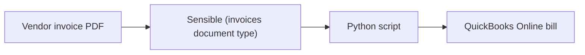

This topic describes sending extracted data from vendor invoices into QuickBooks Online using Sensible and Python.

> **This is a proof-of-concept tutorial.** It is not intended for production use. The OAuth flow, token storage, and credential handling are intentionally simplified for local development. See the inline `PRODUCTION:` comments in [`qbo_auth.py`](https://github.com/sensible-hq/sensible-quickbooks-py) for a summary of what would need to change before deploying this anywhere real.



## Use cases

Vendor invoices often arrive as PDFs emailed by suppliers, downloaded from portals, or scanned from paper. Importing them into your accounting system is a core accounts payable workflow. Here are a few scenarios where automating this with Sensible and QuickBooks Online is valuable:

* **AP automation for bookkeeping services.** You're a SaaS company that handles bookkeeping for small-business clients. Your clients forward vendor invoices to you as PDF documents, and you extract invoice data from the documents automatically and create bills in QBO for the clients to pay.

* **Expense management for growing businesses.** You're a mid-size company receiving dozens of vendor invoices per month across multiple departments. Rather than routing paper invoices through an approval chain and then hand-entering them, you extract the data with Sensible and push it directly into QBO as bills ready for review and payment.

* **Financial ops tooling for vertical SaaS.** You're building a platform for a specific industry (for example, construction, healthcare, or logistics) where your customers receive high volumes of vendor invoices with industry-specific line items. You embed Sensible's extraction into your product and sync bills to your customers' QuickBooks Online accounts via the API.

In this tutorial, you'll set up the first scenario: extracting a vendor invoice with Sensible and creating a bill in QuickBooks Online using Python.

The Python script:

1. Extracts a sample vendor invoice PDF using Sensible's `invoices` document type, and
2. Creates a new bill in QuickBooks Online from the extracted data.

## Add the invoices document type to your Sensible account

The script uses Sensible's `invoices` document type, which is available in the [Sensible configuration library](https://github.com/sensible-hq/sensible-configuration-library). To add support for invoices:

1. Sign up for a [Sensible account](https://app.sensible.so/register) and complete onboarding steps, then navigate to your [dashboard](https://app.sensible.so/dashboard/) in the Sensible app.
2. Click the **Template library** tab.
3. Search for **invoices** or browse by use case.
4. Click the **invoices** document type, then click **Clone to account**. Sensible adds the document type and its extraction configurations to your **Document types** tab.
5. Test the document type by uploading a sample invoice on the **Extract** tab.

## Set up a destination in QuickBooks Online

Before you can run the integration, you need to configure a QuickBooks Online app to test against. If you're using a free Intuit Developer account for testing, take the following steps:

1. Sign in to [developer.intuit.com](https://developer.intuit.com/) and navigate to your workspace.
2. On the **Apps** tab, click the **+** button to create a new app.
3. Name your app (for example, "Sensible Integration Test"), select **com.intuit.quickbooks.accounting** as the OAuth scope, and in the dialog, verify the API Product is **QuickBooks Online**.
4. Click **View credentials** to view and copy the **Client Secret** and **Client ID**. You'll use these as environment variables in a later step. Or, if the dialog is inaccessible:
    1. Click the app you created to open it.
    2. Navigate to the **Keys and credentials** tab and copy the **Client ID** and **Client Secret**. 
5. In your app, add a local redirect to enable authentication in succeeding steps:
    1. Navigate to the **Settings** tab.
    2. Under **Redirect URIs**, verify you're in the **Development** tab, click **Add URI**, enter `http://localhost:8080/callback`, and click **Save**
6. In the upper-right corner, click **My Hub**, select **Sandboxes**, and verify that a default sandbox company exists. In succeeding steps, a Python script creates bills in this company.


## Integrate with Python

You can use Sensible's Python SDK and the `python-quickbooks` library to extract invoices and create bills in QuickBooks Online in a single script.

### Prerequisites

1. In a terminal, use the following commands to download the scripts from GitHub and install prerequisites:

```bash
git clone https://github.com/sensible-hq/sensible-quickbooks-py.git
cd sensible-quickbooks-py
pip install sensible-sdk python-quickbooks intuit-oauth
```

1. Set the following environment variables. To set them for the current terminal session only, run `export VARIABLE=value`. To persist them, add the export commands to your shell profile (e.g. `~/.bashrc` or `~/.zshrc`) and run `source ~/.bashrc` (or `source ~/.zshrc`) to apply them to the current session.

| Variable            | Description                                                  |
| ------------------- | ------------------------------------------------------------ |
| `SENSIBLE_API_KEY`  | Your Sensible API key, available on your Sensible [account page](https://app.sensible.so/account/). |
| `QBO_CLIENT_ID`     | Your QuickBooks app's client ID. In the [Intuit Developer Portal](https://developer.intuit.com/), open your app and navigate to **Keys and credentials**. |
| `QBO_CLIENT_SECRET` | Your QuickBooks app's client secret. In the [Intuit Developer Portal](https://developer.intuit.com/), open your app and navigate to **Keys and credentials**. |

### One-time authentication

Before running the integration for the first time, authorize and to save your QuickBooks tokens. Run the setup script in a terminal (not in an AI coding tool):

```bash
python quickbooks-setup.py # run this in a terminal, not in an AI coding assistant, so you can view and copy the printed authorization URL
```

The script prints an authorization URL. Copy it, open it in your browser, and complete any instructions. Once you authorize, the script saves your tokens automatically. You won't need to reauthorize unless your refresh token expires (after a number of days) or unless your tokens are revoked or deleted locally.

### Extract data from a sample invoice and import to QuickBooks

Run the integration script in a terminal (not in an AI coding tool):

```bash
python invoice_to_quickbooks.py # run this in a terminal, not in an AI coding assistant, to view the full output
```
### Expected output

Running the script produces output like the following:

```bash
python invoice_to_quickbooks.py

[1/5] Extracting invoice with Sensible ...
  ✓ Vendor: Fictional Horticulture Vendor
  ✓ Invoice #: 39
  ✓ Total: 28.215
  ✓ Line items: 4

[2/5] Authenticating with QuickBooks Online ...
  ✓ Connected.

[3/5] Resolving expense account ...
  ✓ Using existing account: 'Uncategorized Expense' (ID 31)

[4/5] Resolving vendor ...
  ✓ Created new vendor: Fictional Horticulture Vendor (ID 59)

[5/5] Creating bill in QuickBooks ...
  • Line 1: Leather Leaf — $20,475.00
  • Line 2: Leather Leaf — $4,620.00
  • Line 3: Leather Leaf — $1,200.00
  • Line 4: Leather Leaf — $1,920.00

============================================================
✓ Bill created successfully for your QuickBooks company. Company ID: 9341456650201556
    ID:     149
    Vendor: Fictional Horticulture Vendor
    Date:   2023-04-02
    Lines:  4
    View:   https://app.sandbox.qbo.intuit.com/app/bill?txnId=149
============================================================
```

Follow the link in the output  to view the created bill in QuickBooks. Or, navigate to your sandbox company's expenses and filter bills by the invoice's date to view the bill:


Compare the bill to the sample vendor invoice PDF to learn how QuickBooks imported the document data:


### What the script does

The script runs five steps:

1. Extracts invoice data using Sensible's LLM-powered `invoices` document type from a local PDF (`invoice_sample.pdf`).
2. Authenticates with QuickBooks Online using your saved tokens (refreshes automatically and silently).
3. Finds a matching expense account in your sandbox company's Chart of Accounts. Checks for common names like "Uncategorized Expense" and "Miscellaneous", or creates one called "Invoice Imports - Needs Review" if none exist.
4. Finds or creates a vendor matching the extracted vendor name.
5. Creates a bill in QuickBooks with the extracted line items.

### Field mapping

The  response from the Sensible API includes a `parsed_document` object containing the extracted document data:

```json
{
    "id": "a588d912-02dc-4637-9c79-7f6992ab772b",
    "created": "2026-04-06T22:19:42.270Z",
    "completed": "2026-04-06T22:20:57.085Z",
    "status": "COMPLETE",
    "type": "invoices",
    "document_name": "invoice_sample",
    "configuration": "llm_invoices_template",
    "environment": "production",
    "page_count": 1,
    "parsed_document": {
        "Vendor name": {
            "value": "Fictional Horticulture Vendor",
            "type": "string",
            "confidenceSignal": "confident_answer"
        },
        "Vendor address": {
            "value": "GUATEMALA, GUATEMALA",
            "type": "string",
            "confidenceSignal": "confident_answer"
        },
        "Customer name": null,
        "Customer address": null,
        "Customer ID (primary)": null,
        "Invoice number": {
            "value": "39",
            "type": "string",
            "confidenceSignal": "confident_answer"
        },
        "Invoice date": {
            "source": "2023-04-02",
            "value": "2023-04-02T00:00:00.000Z",
            "type": "date",
            "confidenceSignal": "confident_answer"
        },
        "Invoice due date": null,
        "Ship Via": null,
        "Ship Date": null,
        "PO number": null,
        "Currency": {
            "value": "USD",
            "type": "string",
            "confidenceSignal": "inferred_answer"
        },
        "Terms": null,
        "Bank_name": null,
        "Bank account name": null,
        "Bank routing number": null,
        "Bank Swift code": null,
        "Bank account number": null,
        "Sub-total before taxes": {
            "source": "28215",
            "value": 28215,
            "type": "number",
            "confidenceSignal": "confident_answer"
        },
        "Tax amount": null,
        "Total amount of invoice": {
            "source": "28.215",
            "value": 28.215,
            "type": "number",
            "confidenceSignal": "confident_answer"
        },
        "line_items": [
            {
                "item_number": null,
                "item_description": {
                    "value": "Leather Leaf",
                    "type": "string"
                },
                "item_boxes": {
                    "source": "450",
                    "value": 450,
                    "type": "number"
                },
                "item_unit_quantity": {
                    "source": "35",
                    "value": 35,
                    "type": "number"
                },
                "item__uom": {
                    "value": "bunches",
                    "type": "string"
                },
                "item__unit_price": {
                    "value": "1,30",
                    "type": "string"
                },
                "item__box_price": {
                    "value": "45,50",
                    "type": "string"
                },
                "item_total": {
                    "value": "20475",
                    "type": "string"
                }
            },
            {
                "item_number": null,
                "item_description": {
                    "value": "Leather Leaf",
                    "type": "string"
                },
                "item_boxes": {
                    "source": "120",
                    "value": 120,
                    "type": "number"
                },
                "item_unit_quantity": {
                    "source": "35",
                    "value": 35,
                    "type": "number"
                },
                "item__uom": {
                    "value": "bunches",
                    "type": "string"
                },
                "item__unit_price": {
                    "value": "1,10",
                    "type": "string"
                },
                "item__box_price": {
                    "value": "38,50",
                    "type": "string"
                },
                "item_total": {
                    "value": "4620",
                    "type": "string"
                }
            },
            
        ]
    },
    "validations": [],
    "validation_summary": {
        "fields": 25,
        "fields_present": 11,
        "errors": 0,
        "warnings": 0,
        "skipped": 0
    },
    "classification_summary": [
        {
            "configuration": "llm_invoices_template",
            "score": {
                "value": 35,
                "fields_present": 35,
                "penalties": 0
            }
        }
    ],
    "errors": [],
   {...}, //abridged response 
}
```

The script reads fields from the `parsed_document` object in the Sensible API response and maps them to QuickBooks Online bill fields:

| Bill field                                      | Sensible field                   | Notes                                                                                                                     |
| ----------------------------------------------- | -------------------------------- | ------------------------------------------------------------------------------------------------------------------------- |
| `bill.VendorRef`                                | `Vendor name`                    | The script searches for an existing QBO vendor with a matching `DisplayName`, or creates a new vendor if none is found.   |
| `bill.TxnDate`                                  | `Invoice date`                   | The date on the invoice.                                                                                                  |
| `bill.DueDate`                                  | `Invoice due date`               | The payment due date, if present on the invoice.                                                                          |
| `bill.DocNumber`                                | `Invoice number`                 | The vendor's invoice number, for cross-referencing.                                                                       |
| `line.Description` (line 1)                     | `line_items[0].item_description` | The description of the first line item.                                                                                   |
| `line.Amount` (line 1)                          | `line_items[0].item_total`       | The amount of the first line item.                                                                                        |
| `line.Description` (line 2)                     | `line_items[1].item_description` | The description of the second line item.                                                                                  |
| `line.Amount` (line 2)                          | `line_items[1].item_total`       | The amount of the second line item.                                                                                       |
| `line.Description` (line n)                     | `line_items[n].item_description` | The script iterates the full `line_items` array and creates one bill line per entry.                                      |
| `line.Amount` (line n)                          | `line_items[n].item_total`       |                                                                                                                           |
| `line.AccountBasedExpenseLineDetail.AccountRef` | _(resolved automatically)_       | All lines use the same expense account, resolved as described in [What the script does](#what-the-script-does).           |


## (Optional) Scale up

This tutorial processes a single local PDF. Here are a few ways to expand on this tutorial.

### Process a batch of invoices

To extract multiple invoices in one run, loop over a directory of PDFs and call `sensible.extract()` for each file. Add error handling to log failures without stopping the batch.

### Trigger extraction automatically by email

Sensible supports automatic extraction of invoices as you receive them via its [email processor](https://docs.sensible.so/docs/getting-started-email). Forward invoices to a Sensible-generated address, and Sensible extracts them and POSTs the extraction response containing the `parsed_document` to your webhook endpoint. Replace the `sensible.extract()` call in the script with a webhook handler on your server.

### Extract other document types

The same pattern works for any document type for which you add support to your Sensible account, for example, purchase orders, receipts, expense reports, and more. Update the `document_type` parameter in the `extract()` call and update the field mapping to match the new document type's fields.

### Production considerations

Before deploying this integration in production, review the `PRODUCTION:` comments throughout `qbo_auth.py`. Key changes include:

* Storing OAuth tokens in a secrets manager (such as AWS Secrets Manager) rather than a local file
* Replacing the browser-based OAuth flow with a proper web redirect flow
* Switching `environment="sandbox"` to `environment="production"` in both the `AuthClient` and `QuickBooks` constructors
* Adding per-account token storage if your service connects to multiple QuickBooks Online companies


### Extract more information

The `invoices` document type has out-of-the-box support for a standard set of fields. To extract additional data or add quality checks, edit the extraction config in the Sensible app:

1. Click **Document types**, then click **invoices**.
2. Click the config name (for example, `llm_invoices_template`) to open the editor.


To extract a field not covered by the default config, add a new entry to the `fields` array describing what you want the LLM to extract using an [LLM-based method](doc:llm-based-methods). For example, extract payment terms with a prompt like `"Payment terms, for example 'Net 30' or 'Due on receipt'"`.

Note that deterministic [layout-based methods](doc:layout-based-methods) for extracting data are generally inapplicable unless you have high volume from vendors that use a consistent layout.

### Postprocess extracted fields

You can transform extracted data with LLMs or with logic. For example:
- You want to add expense categories to line items and the source invoice lacks this information. Add a field that uses the [`customComputation`](doc:custom-computation) method to deterministically categorize line-item expenses based on keywords. Or, chain two LLM prompts together using the [Query Method](doc:query-group) to first extract and then categorize line item expenses.
- You want to validate that the subtotals listed in the invoice actually equal the total amount due. You can create a [validation](doc:validate-extractions) using [JsonLogic](doc:jsonlogic) to flag bad invoices for [human review](doc:human-review). 


