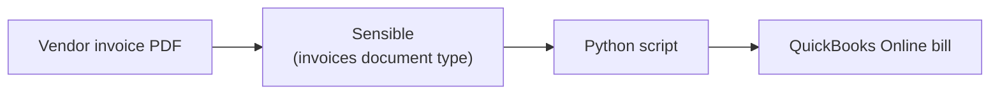

This topic describes sending extracted data from vendor invoices into QuickBooks Online using Sensible and Python.

> **This is a proof-of-concept tutorial.** It is not intended for production use. The OAuth flow, token storage, and credential handling are intentionally simplified for local development. See the inline `PRODUCTION:` comments in `qbo_auth.py` for a summary of what would need to change before deploying this anywhere real.



## Use cases

Vendor invoices often arrive as PDFs emailed by suppliers, downloaded from portals, or scanned from paper. Getting them into your accounting system accurately and quickly is a core accounts payable workflow. Here are a few scenarios where automating this with Sensible and QuickBooks Online is valuable:

* **AP automation for bookkeeping services.** You're a SaaS company that handles bookkeeping for small-business clients. Your clients forward vendor invoices to you as PDF documents, and you extract invoice data from the documents automatically and create bills in QBO for the clients to pay.

* **Expense management for growing businesses.** You're a mid-size company receiving dozens of vendor invoices per month across multiple departments. Rather than routing paper invoices through an approval chain and then hand-entering them, you extract the data with Sensible and push it directly into QBO as bills ready for review and payment.

* **Financial ops tooling for vertical SaaS.** You're building a platform for a specific industry (for example, construction, healthcare, or logistics) where your customers receive high volumes of vendor invoices with industry-specific line items. You embed Sensible's extraction into your product and sync bills to your customers' QuickBooks Online accounts via the API.

In this tutorial, you'll set up the first scenario: extracting a vendor invoice with Sensible and creating a bill in QuickBooks Online using Python.

The Python script:

1. Extracts a vendor invoice PDF using Sensible's `invoices` document type, and
2. Creates a new bill in QuickBooks Online from the extracted data.

## Add the invoices document type to your Sensible account

The script uses Sensible's `invoices` document type, which is available in the [Sensible configuration library](https://github.com/sensible-hq/sensible-configuration-library). To add it to your account:

1. In the Sensible app, click the **Template library** tab.
2. Search for **invoices** or browse by use case.
3. Click the **invoices** document type, then click **Clone to account**. Sensible adds the document type and its extraction configurations to your **Document types** tab.
4. Test the document type by uploading a sample invoice using the **Extract** tab.

## Set up a destination in QuickBooks Online

Before you can run the integration, you need a QuickBooks Online sandbox company to test against. 

**Access a QuickBooks Online sandbox company**

If you're using a free Intuit Developer account for testing:

1. Sign in to [developer.intuit.com](https://developer.intuit.com/) and navigate to your workspace.
2. On the **Apps** tab, click the **+** button to create a new app.
3. Name your app (for example, "Sensible Integration Test"), select **QuickBooks Online and Payments** as the platform, and select **com.intuit.quickbooks.accounting** as the OAuth scope.
4. Click **Open app** to open the app you created.
5. Navigate to the **Keys & credentials** tab and copy the **Client ID** and **Client Secret**. You'll use these as environment variables in a later step.
6. 
7. In the upper-right corner, click **My Hub**, then select **Sandboxes** to verify you have access to a sandbox company that Quickbooks created by default for your account. You don't need to configure the vendors or other sample data in the sandbox company; leave the defaults.

## Integrate with Python

You can use Sensible's Python SDK and the `python-quickbooks` library to extract invoices and create bills in QuickBooks Online in a single script. This approach gives you full control over the data transformation at the line-item level and is suitable for batch processing or server-side automation.

### Get the scripts

Download the scripts from GitHub:

```bash
git clone https://github.com/sensible-hq/sensible-quickbooks-py.git
cd sensible-quickbooks-py
```

### Prerequisites

Install the required libraries:

```bash
pip install sensible-sdk python-quickbooks intuitlib 
```

Set the following environment variables:

| Variable            | Description                                                  |
| ------------------- | ------------------------------------------------------------ |
| `SENSIBLE_API_KEY`  | Your Sensible API key, available on your [account page](https://app.sensible.so/account/). |
| `QBO_CLIENT_ID`     | Your QuickBooks app's client ID. In the [Intuit Developer Portal](https://developer.intuit.com/), open your app and navigate to **Keys and credentials**. |
| `QBO_CLIENT_SECRET` | Your QuickBooks app's client secret. In the [Intuit Developer Portal](https://developer.intuit.com/), open your app and navigate to **Keys and credentials**. |

### One-time setup

Before running the integration for the first time, complete two setup steps.

**Add a redirect URI to your Intuit app**

The authorization script uses a local HTTP server to catch the OAuth callback automatically. To enable this:

1. Navigate to [developer.intuit.com](https://developer.intuit.com/) and open your app.
2. Navigate to the **Settings** tab.
3. Under **Redirect URIs**, click **Add URI**, enter `http://localhost:8080/callback`, and click **Save**.

**Authorize the app**

To authorize and to save your tokens, run the setup script in a regular terminal (not in an AI coding tool) once :

```bash
python quickbooks-setup.py # run this in a bash terminal, not in an AI coding assistant, so you can copy and paste the authorization URL
```

The script prints an authorization URL. Copy it, open it in your browser, and click **Connect**. Once you authorize, the script saves your tokens automatically. You won't need to repeat this unless the refresh token expires (after 100 days of inactivity).

### Run the integration

Run the integration script in a regular terminal (not in an AI coding tool):

```bash
python invoice_to_quickbooks.py # run this in a bash terminal, not in an AI coding assistant, to view the full output
```

### What the script does

The script runs five steps:

1. Extracts invoice data using Sensible's `invoices` document type from a local PDF (`invoice_sample.pdf`).
2. Authenticates with QuickBooks Online using your saved tokens (auto-refreshes silently).
3. Finds a matching expense account in your sandbox company's Chart of Accounts (checking for common names like "Uncategorized Expense" and "Miscellaneous"), or creates one called "Invoice Imports - Needs Review" if none exist.
4. Finds or creates a vendor matching the extracted vendor name.
5. Creates a bill in QuickBooks with the extracted line items.

### Field mapping

The extraction response from Sensible api includes a `parsed_document` object containing the extracted document data:


```json
{
    "id": "a588d912-02dc-4637-9c79-7f6992ab772b",
    "created": "2026-04-06T22:19:42.270Z",
    "completed": "2026-04-06T22:20:57.085Z",
    "status": "COMPLETE",
    "type": "invoices",
    "document_name": "invoice_sample",
    "configuration": "llm_invoices_template",
    "environment": "production",
    "page_count": 1,
    "parsed_document": {
        "Vendor name": {
            "value": "Fictional Horticulture Vendor",
            "type": "string",
            "confidenceSignal": "confident_answer"
        },
        "Vendor address": {
            "value": "GUATEMALA, GUATEMALA",
            "type": "string",
            "confidenceSignal": "confident_answer"
        },
        "Customer name": null,
        "Customer address": null,
        "Customer ID (primary)": null,
        "Invoice number": {
            "value": "39",
            "type": "string",
            "confidenceSignal": "confident_answer"
        },
        "Invoice date": {
            "source": "2023-04-02",
            "value": "2023-04-02T00:00:00.000Z",
            "type": "date",
            "confidenceSignal": "confident_answer"
        },
        "Invoice due date": null,
        "Ship Via": null,
        "Ship Date": null,
        "PO number": null,
        "Currency": {
            "value": "USD",
            "type": "string",
            "confidenceSignal": "inferred_answer"
        },
        "Terms": null,
        "Bank_name": null,
        "Bank account name": null,
        "Bank routing number": null,
        "Bank Swift code": null,
        "Bank account number": null,
        "Sub-total before taxes": {
            "source": "28215",
            "value": 28215,
            "type": "number",
            "confidenceSignal": "confident_answer"
        },
        "Tax amount": null,
        "Total amount of invoice": {
            "source": "28.215",
            "value": 28.215,
            "type": "number",
            "confidenceSignal": "confident_answer"
        },
        "line_items": [
            {
                "item_number": null,
                "item_description": {
                    "value": "Leather Leaf",
                    "type": "string"
                },
                "item_boxes": {
                    "source": "450",
                    "value": 450,
                    "type": "number"
                },
                "item_unit_quantity": {
                    "source": "35",
                    "value": 35,
                    "type": "number"
                },
                "item__uom": {
                    "value": "bunches",
                    "type": "string"
                },
                "item__unit_price": {
                    "value": "1,30",
                    "type": "string"
                },
                "item__box_price": {
                    "value": "45,50",
                    "type": "string"
                },
                "item_total": {
                    "value": "20475",
                    "type": "string"
                }
            },
            {
                "item_number": null,
                "item_description": {
                    "value": "Leather Leaf",
                    "type": "string"
                },
                "item_boxes": {
                    "source": "120",
                    "value": 120,
                    "type": "number"
                },
                "item_unit_quantity": {
                    "source": "35",
                    "value": 35,
                    "type": "number"
                },
                "item__uom": {
                    "value": "bunches",
                    "type": "string"
                },
                "item__unit_price": {
                    "value": "1,10",
                    "type": "string"
                },
                "item__box_price": {
                    "value": "38,50",
                    "type": "string"
                },
                "item_total": {
                    "value": "4620",
                    "type": "string"
                }
            },
            
        ]
    },
    "validations": [],
    "validation_summary": {
        "fields": 25,
        "fields_present": 11,
        "errors": 0,
        "warnings": 0,
        "skipped": 0
    },
    "classification_summary": [
        {
            "configuration": "llm_invoices_template",
            "score": {
                "value": 35,
                "fields_present": 35,
                "penalties": 0
            }
        }
    ],
    "errors": [],
   {...}, //abridged response 
}
```

The script reads fields from the `parsed_document` object in the Sensible API response and maps them to QuickBooks Online bill fields:

| QuickBooks Online field       | Sensible field                   | Notes                                                                                                                     |
| ----------------------------- | -------------------------------- | ------------------------------------------------------------------------------------------------------------------------- |
| **Vendor**                    | `Vendor name`                    | The script searches for an existing QBO vendor with a matching `DisplayName`, or creates a new vendor if none is found.   |
| **Transaction Date**          | `Invoice date`                   | The date on the invoice.                                                                                                  |
| **Due Date**                  | `Invoice due date`               | The payment due date, if present on the invoice.                                                                          |
| **Ref No.**                   | `Invoice number`                 | The vendor's invoice number, for cross-referencing.                                                                       |
| **Line 1 - Description**      | `line_items[0].item_description` | The description of the first line item.                                                                                   |
| **Line 1 - Amount**           | `line_items[0].item_total`       | The amount of the first line item.                                                                                        |
| **Line 2 - Description**      | `line_items[1].item_description` | The description of the second line item.                                                                                  |
| **Line 2 - Amount**           | `line_items[1].item_total`       | The amount of the second line item.                                                                                       |
| **Line n - Description**      | `line_items[n].item_description` | The script iterates the full `line_items` array and creates one QBO bill line per entry.                                  |
| **Line n - Amount**           | `line_items[n].item_total`       |                                                                                                                           |
| **Line - Account**            | _(resolved automatically)_       | All lines use the same expense account, resolved as described in [What the script does](#what-the-script-does).           |

### Expected output

Running the script produces output like the following:

```bash
python invoice_to_quickbooks.py

[1/5] Extracting invoice with Sensible ...
  ✓ Vendor: Fictional Horticulture Vendor
  ✓ Invoice #: 39
  ✓ Total: 28.215
  ✓ Line items: 4

[2/5] Authenticating with QuickBooks Online ...
  ✓ Connected.

[3/5] Resolving expense account ...
  ✓ Using existing account: 'Uncategorized Expense' (ID 31)

[4/5] Resolving vendor ...
  ✓ Created new vendor: Fictional Horticulture Vendor (ID 59)

[5/5] Creating bill in QuickBooks ...
  • Line 1: Leather Leaf — $20,475.00
  • Line 2: Leather Leaf — $4,620.00
  • Line 3: Leather Leaf — $1,200.00
  • Line 4: Leather Leaf — $1,920.00

============================================================
  ✓ Bill created successfully!
    ID:     149
    Vendor: Fictional Horticulture Vendor
    Date:   2023-04-02
    Lines:  4
    View:   https://app.sandbox.qbo.intuit.com/app/bill?txnId=149
============================================================
```

Follow the link to view the created bill:


Compare it to the sample invoice to see how Quickbooks imported the document data:


## (Optional) Scale up

This tutorial processes a single local PDF. Here are a few directions for going further.

**Process a batch of invoices**

To extract multiple invoices in one run, loop over a directory of PDFs and call `sensible.extract()` for each file. Add error handling to log failures without stopping the batch.

**Trigger extraction automatically by email**

Sensible supports automatic extraction via Zapier or its [email processor](https://docs.sensible.so/docs/getting-started-email): forward invoices to a Sensible-generated address, and Sensible extracts them and POSTs the `parsed_document` to your webhook endpoint. Replace the `sensible.extract()` call in the script with a webhook handler on your server.

**Extract other document types**

The same pattern works for any document type for which you add support to your Sensible account --  purchase orders, receipts, expense reports, and more. Swap the `document_type` parameter in the `extract()` call and update the field mapping to match the new document type's fields.

**Production considerations**

Before deploying this integration in production, review the `PRODUCTION:` comments throughout `qbo_auth.py`. Key changes include:

* Storing OAuth tokens in a secrets manager (such as AWS Secrets Manager) rather than a local file
* Replacing the browser-based OAuth flow with a proper web redirect flow
* Switching `environment="sandbox"` to `environment="production"` in both the `AuthClient` and `QuickBooks` constructors
* Adding per-account token storage if your service connects to multiple QuickBooks Online companies

