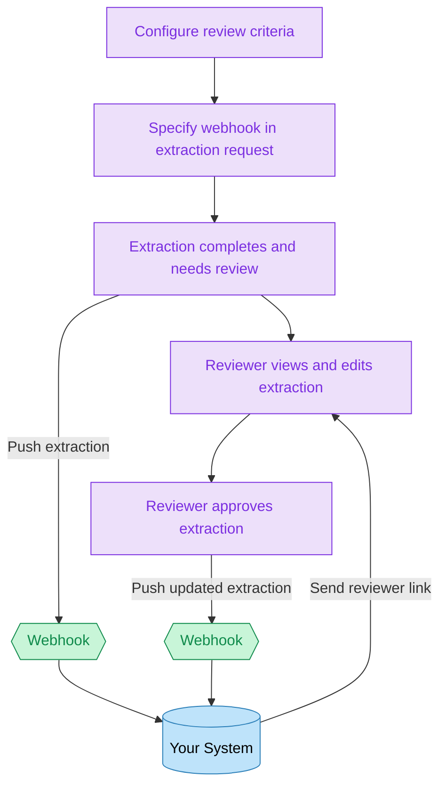

When you extract document data at scale using Sensible, automating human-in-the-loop review can become essential to your quality-control process.

The following diagram shows how to integrate human-in-the-loop review into your application:

1. **Enable review and configure review triggers**: Enable and configure extraction quality validation for a document type, for example, tax documents or pay stubs. Any extraction in the document type that doesn’t meet your quality [validations](doc:validate-extractions) triggers a human review.
2. **Specify a webhook for each document extraction:** When extracting data from a document using Sensible’s API or SDK, specify a webhook destination URL that receives updates to the extraction’s review status.
3. **Notify a reviewer**: When the webhook indicates that a completed extraction needs review and correction, notify a reviewer and send them a link to the review interface that they can following without having to log in to Sensible.
4. **Ingest corrected extractions**: When the webhook indicates that a reviewer approved an extraction, ingest the document data into your system.

For a tutorial on implementing these steps, see [How to automate human-in-the-loop review for document processing](https://www.sensible.so/blog/human-review-document-processing).
