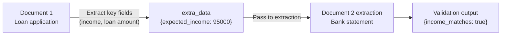
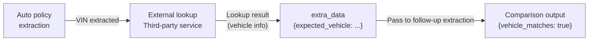
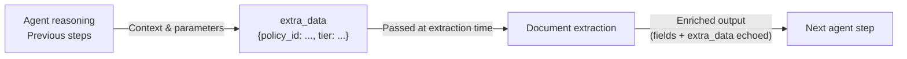
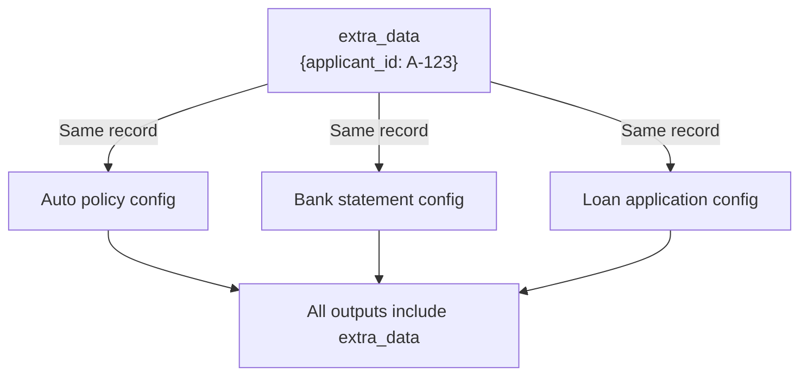

# Introducing extra data: bring external context into document extraction

**Subtitle:** Pass request-time data into your configs to validate, compare, and enrich extracted output — without post-processing.

---

Document extraction rarely happens in isolation. Real workflows involve multiple documents, upstream systems, and business logic that exists outside any single file. An insurance platform might need to verify that the deductible on a declarations page matches what's on record in their policy system. A mortgage pipeline might need to cross-check a bank statement against figures from a loan application. A document AI agent might need to carry context from a previous reasoning step into the next extraction call.

Until now, making that work meant extracting data first, then comparing it in application code. With extra data, you can bring that external context directly into the extraction.

---

## What is extra data?

`extra_data` is a flat key/value record you attach to an async extraction request:

```json
{
  "document_url": "https://...",
  "extra_data": {
    "expected_premium": 1250.00,
    "applicant_id": "A-123"
  }
}
```

Sensible passes the record into your config at extraction time. Any field in the config can read a value from it using the [`extraData`](https://docs.sensible.so/docs/extra-data) computed field method. The record is echoed back in extraction responses and webhook deliveries, so it travels with the data through your pipeline.

---

## What you can build with it

**Cross-document validation**

Extract fields from a first document — a loan application, say — then pass key values as `extra_data` into a subsequent extraction for that applicant's bank statement. The bank statement config compares the incoming expected values against what it finds in the document, outputting Boolean fields that flag any discrepancies. No application-side comparison logic required.



**Incorporating external data**

After extracting a VIN from an auto insurance policy, query a third-party lookup service and pass the result back as `extra_data` in a follow-up extraction. The config uses [`extraData`](https://docs.sensible.so/docs/extra-data) with [`customComputation`](https://docs.sensible.so/docs/custom-computation) to flag discrepancies between the lookup value and what the document shows — bringing external system data directly into the extraction output.



**Agentic document pipelines**

For teams building LLM-powered pipelines, `extra_data` is a natural handoff point between your agent's reasoning and the extraction step. Pass context from previous steps, retrieved records, or user-supplied parameters into the extraction, and get it back in the output alongside the extracted fields.



**Portfolio extractions**

When you submit a portfolio extraction with `extra_data`, Sensible passes the same record to every document extracted from the portfolio. Each document's config can independently access it — no separate records needed per document type.



---

## How it works

In your config, [`extraData`](https://docs.sensible.so/docs/extra-data) works as a computed field method. Specify a key to look up in the `extra_data` record, and Sensible returns the value as a computed field. Use that field's output in downstream computed fields — for example, with [`customComputation`](https://docs.sensible.so/docs/custom-computation) and [JsonLogic](https://jsonlogic.com) to compare against extracted values.

Here's a concrete example: a config that cross-checks values from a policy management system against a GEICO auto insurance declarations page. It uses two comparison strategies depending on the data type.

For numeric values (deductibles), `customComputation` handles exact equality. For a vehicle description, [`queryGroup`](https://docs.sensible.so/docs/query-group) with [`source_ids`](https://docs.sensible.so/docs/query-group) uses the LLM to compare semantically — so `"NISSAN ROGUE 2010"` (policy system) correctly matches `"2010 Nissan Rogue"` (document), even though the strings aren't equal.

**Config**

```json
{
  "fields": [
    {
      "id": "collision_deductible",
      "type": "currency",
      "anchor": {
        "match": [
          { "text": "Coverages", "type": "startsWith" },
          { "text": "Collision", "type": "startsWith" }
        ]
      },
      "method": { "id": "row", "position": "right", "tiebreaker": "first" }
    },
    {
      "id": "expected_insured_vehicle",
      "method": { "id": "extraData", "key": "expected_insured_vehicle" }
    },
    {
      "method": {
        "id": "queryGroup",
        "queries": [
          {
            "id": "insured_vehicle",
            "description": "year, make, and model of the first vehicle listed on the policy",
            "type": "string"
          }
        ]
      }
    },
    {
      "method": {
        "id": "queryGroup",
        "source_ids": ["expected_insured_vehicle", "insured_vehicle"],
        "queries": [
          {
            "id": "vehicle_matches",
            "description": "Do these two vehicle descriptions refer to the same vehicle? Ignore differences in capitalization and word order. Answer true or false.",
            "type": "boolean"
          }
        ]
      }
    }
  ],
  "computed_fields": [
    {
      "id": "expected_collision_deductible",
      "method": { "id": "extraData", "key": "expected_collision_deductible" }
    },
    {
      "id": "collision_deductible_matches",
      "method": {
        "id": "customComputation",
        "jsonLogic": {
          "==": [
            { "var": "collision_deductible.value" },
            { "var": "expected_collision_deductible.value" }
          ]
        }
      }
    }
  ]
}
```

**Request**

```json
{
  "document_url": "https://...",
  "extra_data": {
    "expected_collision_deductible": 500,
    "expected_insured_vehicle": "NISSAN ROGUE 2010"
  }
}
```

**Output**

`vehicle_matches` is `true` even though the strings aren't equal. `collision_deductible_matches` is `true` because the amounts match exactly.

```json
{
  "collision_deductible": { "value": 500, "type": "currency", "unit": "$", "source": "$500" },
  "expected_insured_vehicle": { "value": "NISSAN ROGUE 2010", "type": "string" },
  "insured_vehicle": { "value": "2010 Nissan Rogue", "type": "string" },
  "vehicle_matches": { "value": true, "type": "boolean" },
  "expected_collision_deductible": { "value": 500, "type": "number" },
  "collision_deductible_matches": { "value": true, "type": "boolean" }
}
```

---

## Getting started

`extra_data` is available today on the Extract from URL and Generate Upload URL endpoints. To get started:

1. Add an `extra_data` object to your extraction request with the key/value pairs your config needs.
2. In your config, add computed fields using the [`extraData`](https://docs.sensible.so/docs/extra-data) method to read those values.
3. Use the computed field output in downstream [`customComputation`](https://docs.sensible.so/docs/custom-computation) fields to validate, compare, or enrich your extraction.

For a full walkthrough with a worked example, see the [extra data documentation](https://docs.sensible.so/docs/extra-data).

---

Ready to try it? [Sign up for free](https://app.sensible.so/register) or [talk to our team](https://www.sensible.so/contact) to see how extra data fits into your document pipeline.

---

## Frequently asked questions

**What is extra data in Sensible?**

`extra_data` is a flat key/value record you attach to an async extraction request. Sensible passes it into your SenseML config at extraction time, where you can read individual values using the [`extraData`](https://docs.sensible.so/docs/extra-data) method and use them in computed fields for comparison, validation, or enrichment.

**How do I validate a document field against a value from my system of record?**

Pass the expected value as a key in `extra_data` when you submit the extraction. In your config, read it with the [`extraData`](https://docs.sensible.so/docs/extra-data) method, then use [`customComputation`](https://docs.sensible.so/docs/custom-computation) with JsonLogic to compare it against the extracted field. The result is a Boolean field in your extraction output — no post-processing required.

**Can I use extra data with portfolio extractions?**

Yes. When you attach `extra_data` to a portfolio extraction request, Sensible passes the same record to every document in the portfolio. Each document type's config can independently read values from it using the [`extraData`](https://docs.sensible.so/docs/extra-data) method.

**How does extra data compare to validating fields in application code?**

Post-processing comparisons in application code run after extraction, on data that's already been returned. `extra_data` moves that logic into the extraction itself — the comparison result ships as part of the extraction output, travels with webhook deliveries, and is visible in the Sensible app alongside other extracted fields. This simplifies pipeline logic and keeps validation closer to the data.

**What SenseML methods can read extra data?**

The [`extraData`](https://docs.sensible.so/docs/extra-data) computed field method reads values from the `extra_data` record by key. The resulting field can then be used as an input to any downstream computed field — including [`customComputation`](https://docs.sensible.so/docs/custom-computation) for rule-based comparisons and [`queryGroup`](https://docs.sensible.so/docs/query-group) with [`source_ids`](https://docs.sensible.so/docs/query-group) for LLM-based semantic comparisons.

---

> **Notes before publishing:**
> - Add a workflow diagram showing the `extra_data` flow (similar to the email extraction post's pipeline diagram)
> - Coordinate publish timing with the docs page going live (currently hidden)
> - If the in-app `extra_data` UI is shipping around the same time, add a section covering it
